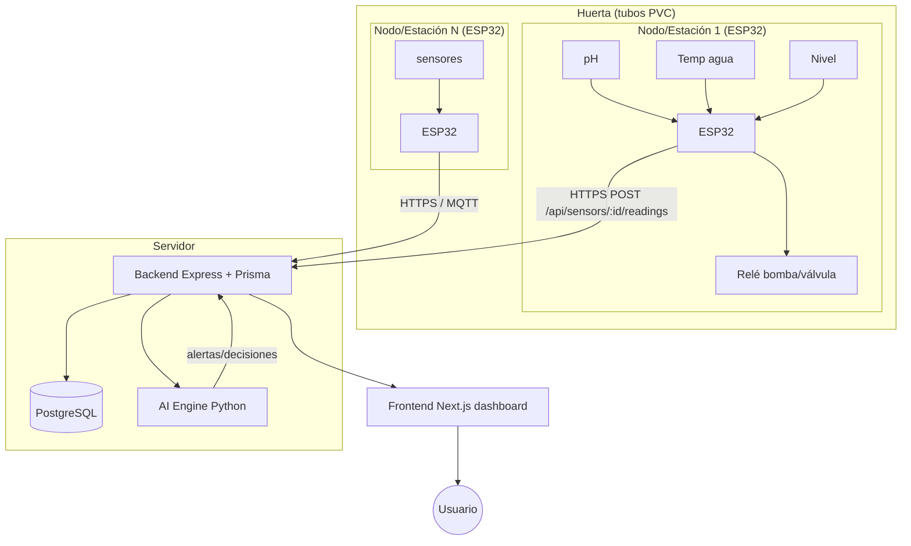
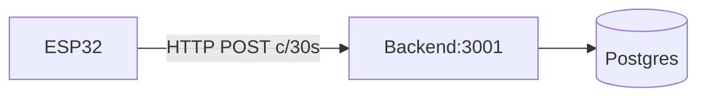
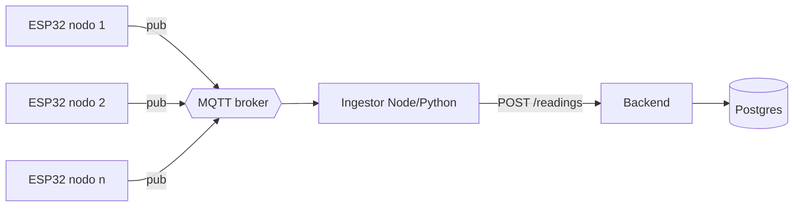

# Arquitectura del sistema — Mallki Sapan

Cómo se conecta el hardware de la huerta hidropónica con el backend, la IA y el
frontend, y cómo escalar de **1 tubo de PVC** a **N estaciones**.

---

## 1. Vista general



**Flujo de datos (camino feliz):**
1. Cada nodo ESP32 lee pH, temperatura del agua y nivel cada `SAMPLE_INTERVAL`.
2. Filtra (mediana/promedio), convierte a unidades reales (pH, °C, %).
3. Hace `POST /api/sensors/{SENSOR_ID}/readings` con `{ "value": <número> }`.
4. El backend guarda la lectura, actualiza `lastValue/status` del sensor.
5. El AI-engine lee históricos, genera alertas (`/api/alerts`) y decisiones de
   riego (`/api/irrigation`).
6. El frontend muestra todo en tiempo casi real (polling / futuro websocket).

---

## 2. Contrato de ingesta (hoy)

El firmware usa el API que **ya existe**:

| Acción | Método | Endpoint | Body |
|--------|--------|----------|------|
| Alta de sensor | `POST` | `/api/sensors` | `{ name, type, unit }` |
| Enviar lectura | `POST` | `/api/sensors/:id/readings` | `{ value, timestamp? }` |
| Leer históricos | `GET` | `/api/sensors/:id/readings?hours=24` | — |
| Riego automático (con chequeo de nivel) | `POST` | `/api/irrigation/auto` | `{ zoneIds, duration, trigger }` |
| ¿Se puede regar? | `GET` | `/api/irrigation/can-irrigate` | → `{ allowed, level, reason }` |

Cada sensor físico = una fila en `sensors`. El `id` (cuid) se carga en el
`config.h` del firmware. Ejemplo de alta:

```bash
curl -X POST http://SERVIDOR:3001/api/sensors \
  -H 'Content-Type: application/json' \
  -d '{"name":"pH Tubo 1","type":"ph","unit":"pH"}'
# → { "id": "clxxx...", ... }   ← ese id va en config.h
```

---

## 3. Topología de red — evolución por etapas

### Etapa 0 — Prototipo (1 nodo, HTTP directo)
ESP32 → WiFi casa → backend en tu PC/servidor. Es la que arma el firmware actual.
Simple, suficiente para 1–3 nodos.



### Etapa 1 — Varias estaciones (MQTT)
Cuando hay muchos nodos, el POST HTTP por sensor no escala bien (reconexiones,
retries). Meté un **broker MQTT** (Mosquitto) y un pequeño *ingestor*.



Convención de tópicos:
```
mallki/{nodo}/{sensor}/reading      → {"value":6.4,"ts":"..."}
mallki/{nodo}/status                → {"rssi":-62,"uptime":3600,"fw":"1.2.0"}
mallki/{nodo}/cmd/irrigate          ← comando hacia el nodo (bomba ON/OFF)
```

Ventajas: QoS/retención, comando bidireccional (riego remoto), un solo punto de
ingestión, offline buffering.

### Etapa 2 — Producción / multi-huerta
- Broker MQTT con TLS + auth por nodo.
- Backend detrás de reverse proxy (Caddy/Nginx) con HTTPS.
- Tabla `nodes` (registro de estaciones) y `sensors.nodeId`.
- OTA de firmware (ESP32 `Update.h` o ESP-IDF OTA).
- Series temporales: si crece mucho, `TimescaleDB` (extensión de Postgres) sobre
  `sensor_readings`.

---

## 4. Modelo de datos — extensiones para escalar

Hoy `Sensor` no sabe a qué nodo/tubo pertenece. Para multi-estación:

```prisma
model Node {
  id        String   @id @default(cuid())
  name      String                 // "Estación Tubo 1"
  location  String                 // "Invernadero A / fila 2"
  firmware  String?
  lastSeen  DateTime?
  rssi      Int?
  online    Boolean  @default(false)
  createdAt DateTime @default(now())
  sensors   Sensor[]
  @@map("nodes")
}

// en Sensor:
model Sensor {
  // ...campos actuales...
  nodeId String?
  node   Node?   @relation(fields: [nodeId], references: [id])
}

enum SensorType {
  // ...actuales...
  water_level   // % del tanque
  ec            // conductividad mS/cm
}
```

Con esto el dashboard puede agrupar sensores por estación/tubo y marcar nodos
offline (heartbeat). Ver SQL en [circuitos §8](../hardware/circuitos.md#8-extensión-del-modelo-de-datos-para-escalar).

---

## 5. Confiabilidad (lo que hay que resolver sí o sí)

| Problema | Solución en el diseño |
|----------|----------------------|
| Se cae el WiFi | Buffer local en el ESP32 (cola en RAM/NVS) y reintento con backoff |
| El backend no responde | Reintentos con backoff exponencial; no bloquear el loop de lectura |
| Lecturas ruidosas (pH, ultrasónico) | Mediana de N muestras en firmware (ya incluido) |
| Deriva de sensores | Calibración periódica + alerta si el valor sale de rango físico |
| Nodo colgado | Watchdog del ESP32 (`esp_task_wdt`) → auto-reset |
| Corte de luz | UPS/batería para la bomba y el nodo; al volver, re-sincroniza |
| Seguridad | HTTPS, token por nodo (`Authorization: Bearer`), MQTT con credenciales |

---

## 6. Frecuencias recomendadas

| Parámetro | Muestreo | Envío |
|-----------|----------|-------|
| pH | cada 10 s (promedio) | cada 60 s |
| Temp agua | cada 10 s | cada 60 s |
| Nivel | cada 30 s | cada 60 s o al cambiar >2% |
| Heartbeat/estado | — | cada 60 s |

Enviar demasiado seguido llena la DB sin aportar; para pH/temp del agua, que
cambian lento, 1 lectura/minuto es de sobra. Guardá el detalle fino solo si vas a
diagnosticar.

---

## 7. Seguridad eléctrica y física (resumen)

- Baja tensión (sensores) y 220V (bomba) **físicamente separados**, relé de por medio.
- Electrónica en caja **IP65**, prensacables, lejos de salpicaduras.
- GND común de toda la baja tensión.
- Bomba/nodo con protección diferencial y, si podés, UPS.

---

## 8. Roadmap de escalado (resumen)

1. **MVP (Etapa 0):** 1 ESP32, 3 sensores, POST HTTP directo. *(firmware actual)*
2. **Riego automático:** agregar relé + lógica de decisión (umbral de nivel/pH).
3. **Multi-nodo (Etapa 1):** MQTT + ingestor + tabla `nodes`.
4. **IA:** AI-engine consume históricos, ajusta setpoints, detecta anomalías.
5. **Producción (Etapa 2):** TLS, OTA, TimescaleDB, multi-huerta.

Detalle de casos de uso y reglas en el
[documento funcional](../funcional/especificacion-funcional.md).
