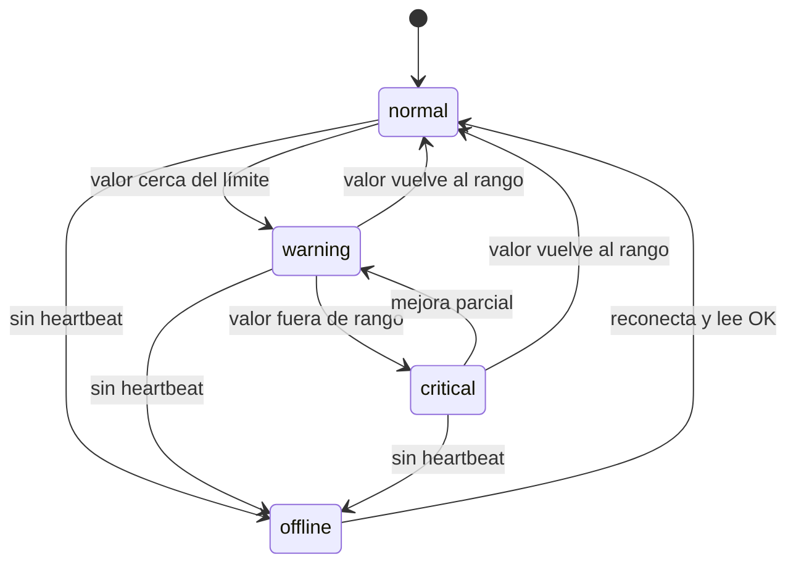

# Especificación funcional — Monitoreo hidropónico Mallki Sapan

Qué hace el sistema, con qué reglas, y cómo se comporta ante cada situación.
Alcance de este documento: **monitoreo de parámetros** de la solución nutritiva y
la base para el **riego/dosificación automáticos**.

---

## 1. Objetivo

Automatizar el monitoreo de una huerta **hidropónica en tubos de PVC** (NFT/DWC),
midiendo de forma continua **pH, temperatura del agua y nivel del tanque** (y, a
futuro, EC/nutrientes), enviando los datos a una plataforma que:
- muestra el estado en un dashboard,
- genera **alertas** cuando algo sale de rango,
- decide/ejecuta **riego y correcciones** de forma automática o asistida por IA.

---

## 2. Parámetros y rangos objetivo

| Parámetro | Unidad | Rango óptimo | Warning | Crítico | Acción si sale de rango |
|-----------|--------|--------------|---------|---------|-------------------------|
| pH | pH | 5.5 – 6.5 | 5.5–5.0 / 7.5–8.0 | <5.0 o >8.0 | Alerta; (futuro) dosificar pH±  |
| Temp. del agua | °C | 18 – 24 | 15–18 / 24–28 | <10 o >35 | Alerta; ventilar/sombrear |
| Nivel del tanque | % | > 30 | 15 – 30 | < 15 | Alerta; (futuro) rellenar / apagar bomba |
| EC (nutrientes)* | mS/cm | 1.2 – 2.2 | 1.0–1.2 / 2.2–2.4 | <0.8 o >2.8 | Alerta; (futuro) dosificar nutriente |

\* EC es recomendado agregar; sin él no se controla la concentración de nutrientes.

> Los umbrales viven en `backend/src/routes/sensors.ts` (función que calcula
> `status`). Ajustables por cultivo/etapa desde el AI-engine a futuro.

---

## 3. Actores

| Actor | Rol |
|-------|-----|
| **Nodo ESP32** | Mide, filtra y envía lecturas; ejecuta comandos de riego. |
| **Backend** | Recibe lecturas, calcula estado, guarda histórico, expone API. |
| **AI Engine** | Analiza tendencias, decide riego/dosificación, genera alertas. |
| **Frontend** | Muestra estado, históricos, alertas; permite acciones manuales. |
| **Usuario (huertero)** | Calibra sensores, atiende alertas, aprueba acciones. |

---

## 4. Casos de uso

### CU-01 — Lectura periódica de parámetros
- **Disparador:** temporizador del nodo (cada `SAMPLE_INTERVAL`).
- **Flujo:** nodo lee pH/temp/nivel → filtra → `POST /readings` por sensor.
- **Éxito:** lectura guardada; `lastValue`/`status` actualizados.
- **Alternativo:** sin red → guarda en buffer y reintenta con backoff.

### CU-02 — Detección de condición fuera de rango
- **Disparador:** una lectura cae en warning/crítico.
- **Flujo:** backend marca `status`; AI-engine crea `Alert` con severidad y
  `aiRecommendation`.
- **Éxito:** alerta visible en el dashboard (y notificación a futuro).

### CU-03 — Nivel de tanque bajo
- **Disparador:** nivel < 15%.
- **Flujo:** alerta `irrigation` crítica. Si hay riego automático: **apagar bomba**
  para no trabajar en seco y avisar "rellenar tanque".
- **Éxito:** bomba protegida; usuario notificado.

### CU-04 — Riego automático (fase 2)
- **Disparador:** programación horaria **o** decisión IA (p. ej. temp alta).
- **Flujo:** backend/AI manda `cmd/irrigate` al nodo → relé ON `duration` →
  `POST /api/irrigation` registra el evento (volumen, zonas).
- **Restricción:** no regar si nivel < umbral (CU-03).

### CU-05 — Corrección de pH / nutrientes (fase 3)
- **Disparador:** pH o EC fuera de rango sostenido.
- **Flujo:** dosificar pH-/pH+ o nutriente con bomba peristáltica; re-medir tras
  mezclado; registrar acción.
- **Restricción:** dosis máxima por ciclo (seguridad), espera de estabilización.

### CU-06 — Calibración de sensor
- **Disparador:** usuario (periódico).
- **Flujo:** modo calibración → medir buffers pH 4/7 → guardar `v4/v7` →
  actualizar `config.h`/parámetros. Registrar fecha de última calibración.

### CU-07 — Nodo offline
- **Disparador:** no llega heartbeat en `2 × intervalo`.
- **Flujo:** marcar nodo/sensores `offline`; alerta al usuario.

---

## 5. Reglas de negocio

- **RN-01:** Nunca encender la bomba con nivel < 15% (protección de bomba).
- **RN-02:** Una lectura fuera de rango físico imposible (p. ej. pH < 0 o > 14, o
  nivel < 0) se **descarta** y se marca posible falla de sensor.
- **RN-03:** El pH se interpreta junto a la temperatura del agua (compensación).
- **RN-04:** Toda acción automática (riego/dosificación) queda **registrada y es
  auditable** (quién/qué la disparó: `scheduled | ai_decision | manual`).
- **RN-05:** Las dosis de químicos tienen tope por ciclo y tiempo de espera.
- **RN-06:** Si la red falla, no se pierden lecturas (buffer local + reintento).

---

## 6. Requerimientos no funcionales

| Categoría | Requerimiento |
|-----------|---------------|
| Frecuencia | Lectura ≤ 60 s por parámetro (config.). |
| Latencia | Alerta crítica visible < 2 min desde la lectura. |
| Disponibilidad | Nodo se auto-recupera (watchdog) ante cuelgue. |
| Resiliencia | Tolera caídas de WiFi/backend sin perder datos. |
| Seguridad | API sobre HTTPS; token por nodo; 220V aislado por relé. |
| Escalabilidad | De 1 a N nodos sin rediseño (MQTT + tabla `nodes`). |
| Mantenibilidad | Calibración y config sin recompilar (a futuro, vía API). |
| Precisión | pH ±0.1 tras calibración; temp ±0.5 °C; nivel ±3%. |

---

## 7. Estados del sistema (por sensor)

---

## 8. Fuera de alcance (por ahora)

- Visión por cámara / detección de plagas (está en el AI-engine, otro documento).
- Control de clima (temperatura ambiente, CO₂).
- App móvil nativa (el dashboard web es responsive).

---

## 9. Criterios de aceptación del MVP

- [ ] Un nodo ESP32 mide pH, temp del agua y nivel, y los publica cada ≤60 s.
- [ ] El dashboard muestra los 3 valores con su `status` (normal/warning/critical).
- [ ] Al sacar la sonda de pH del rango, aparece una alerta en < 2 min.
- [ ] Si se corta el WiFi y vuelve, no se pierden lecturas del período.
- [ ] pH calibrado a 2 puntos con error ≤ ±0.1 vs. buffer.
- [ ] Nivel de tanque reportado en % coherente con la altura real del agua.

Detalle de hardware en [circuitos](../hardware/circuitos.md) y de topología en
[arquitectura](../arquitectura/arquitectura.md).
