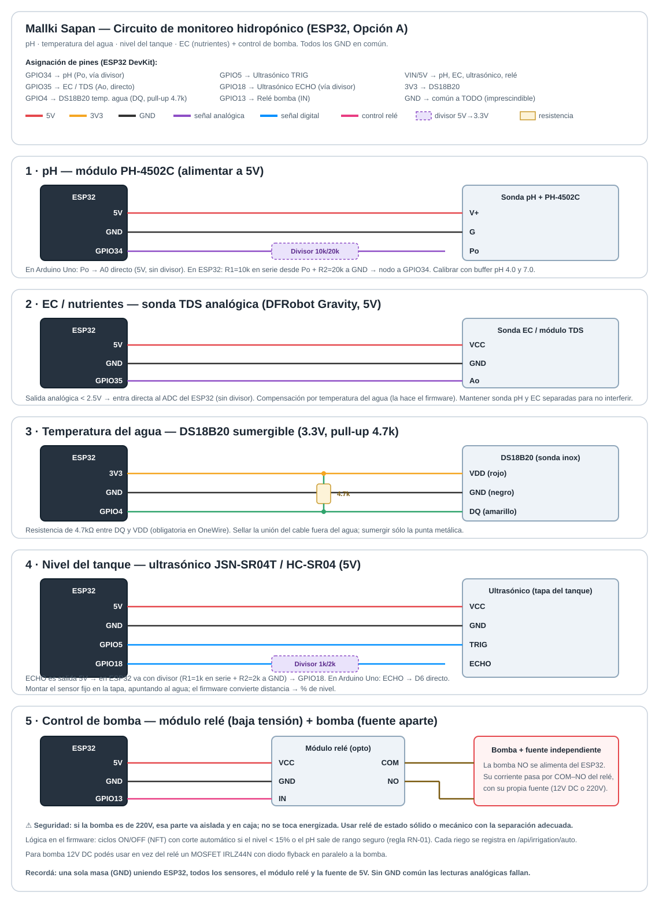
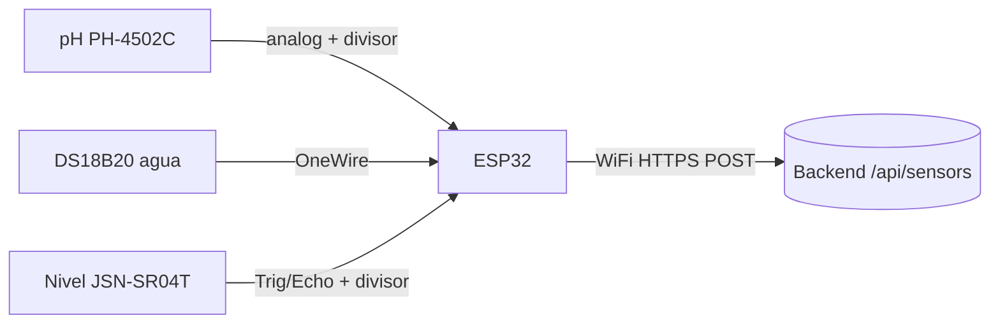
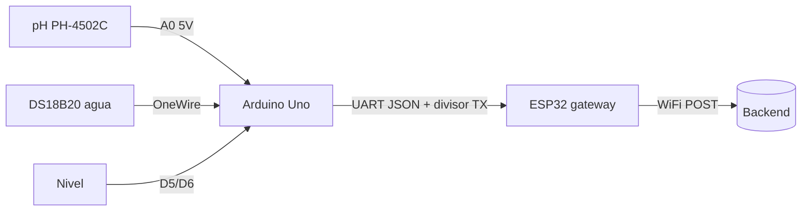
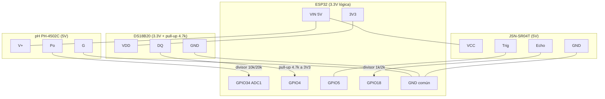

# Circuitos de monitoreo — Mallki Sapan (hidroponía en tubos PVC)

Guía de cableado para monitorear los parámetros de la solución nutritiva en un
sistema hidropónico NFT/DWC en tubos de PVC, con **Arduino Uno** + **ESP32**.

> **Regla de oro de seguridad eléctrica**: los sensores van sobre 3.3V/5V (baja
> tensión). Todo lo que conmute la bomba, válvulas o luces (220V) va con
> **relé + fuente separada** y **nunca** se cablea directo al micro. Ver
> [Actuadores](#7-actuadores-bomba--válvula).

## 📐 Dibujo del circuito completo



Diagrama con cada sub-circuito (pH, temperatura del agua, nivel, EC y relé) y sus
resistencias/divisores: [`circuito-esp32.svg`](circuito-esp32.svg). El detalle de
cada conexión está abajo.

---

## 1. Qué medimos y con qué

| Parámetro | Sensor típico | Señal | Rango útil hidroponía | Estado en backend (`type`) |
|-----------|---------------|-------|-----------------------|----------------------------|
| **pH** de la solución | Módulo PH-4502C + sonda BNC | Analógica 0–3V (Po) | 5.5 – 6.5 | `ph` |
| **Temperatura del agua** | DS18B20 sumergible | Digital OneWire | 18 – 24 °C | `temperature` |
| **Nivel del tanque** | Ultrasónico JSN-SR04T (recomendado) o HC-SR04, o flotador | Trig/Echo o digital | > 20% del tanque | `water_level` *(nuevo, ver §8)* |
| **EC / nutrientes** *(recomendado agregar)* | Sonda EC + TDS meter (Gravity DFRobot) | Analógica | 1.2 – 2.2 mS/cm | `ec` *(nuevo, ver §8)* |

> El sensor de nivel que ya tenés "que revisa nivel pero no está conectado" se
> integra en **§4**. Sin importar el tipo (ultrasónico, flotador o resistivo),
> ahí está cómo conectarlo al Arduino/ESP32.

---

## 2. Elegir el cerebro: dos arquitecturas de cableado

Tenés Uno **y** ESP32. Las dos sirven; cambia dónde se leen los sensores.

### Opción A — ESP32 como nodo único *(recomendada para empezar)*
El ESP32 lee los 3 sensores **y** manda los datos por WiFi al backend. El Arduino
Uno queda libre para actuadores/expansión.



- ✅ Menos hardware, WiFi nativo, ADC de 12 bits.
- ⚠️ ESP32 es 3.3V: el pH (Po) y el Echo del ultrasónico necesitan **divisor de
  tensión** (§3.1 y §4.1). El ADC del ESP32 es algo no lineal → calibración a 2
  puntos obligatoria.

### Opción B — Uno lee sensores, ESP32 como gateway WiFi
El Uno (5V nativo, ADC más "prolijo" para pH) lee todo y manda por **Serial/UART**
al ESP32, que reenvía por WiFi.



- ✅ El pH se lee a 5V sin divisor (rango completo del módulo, más resolución útil).
- ⚠️ Dos micros. El **TX del Uno (5V) → RX del ESP32 (3.3V)** necesita divisor o
  level shifter (§6).

**Recomendación:** empezá con **Opción A**. Migrá a B solo si necesitás que el pH
sea muy estable y el Uno para actuadores.

---

## 3. pH — módulo PH-4502C

El módulo se alimenta a **5V** (tanto en Uno como en ESP32; el 5V sale del USB/VIN).
Tiene 4 pines útiles: `V+` (5V), `G` (GND), `Po` (salida analógica de pH), `To`
(temperatura, opcional). Trae 2 potenciómetros: uno de **offset** (calibrar pH 7)
y otro de **límite de disparo** (ignoralo, es para el comparador digital `Do`).

### 3.1 Cableado

**En Arduino Uno (5V — sin divisor):**

| Módulo PH-4502C | Arduino Uno |
|-----------------|-------------|
| V+ | 5V |
| G  | GND |
| Po | A0 |
| To | (sin conectar) |

**En ESP32 (3.3V lógica — CON divisor en Po):**

El Po puede acercarse a 3V; para proteger el ADC (máx 3.3V) y quedar en zona
lineal, poné un divisor 2:3 (o simplemente medí y ajustá el `PH_DIVIDER` del
firmware). Alimentá el módulo a **5V** (pin VIN/5V del ESP32).

```
 Po ──[ R1 = 10k ]──┬──► GPIO34 (ADC1)
                    │
                  [ R2 = 20k ]
                    │
                   GND
```
Factor del divisor = R2/(R1+R2) = 20/30 = 0.667. Se compensa en calibración.

| Módulo PH-4502C | ESP32 |
|-----------------|-------|
| V+ | 5V (VIN) |
| G  | GND (común con ESP32) |
| Po | → divisor → GPIO34 |

> Usá **solo pines ADC1** en ESP32 (GPIO32–39) porque ADC2 se pelea con el WiFi.
> GPIO34–39 son **input-only**, ideales para sensores.

### 3.2 Calibración (2 puntos, obligatoria)

1. Enjuagá la sonda en agua destilada.
2. Sumergila en **buffer pH 7.0** → anotá el voltaje que imprime el firmware (`v7`).
   Ajustá el pote de offset hasta ~2.5V si querés centrar.
3. Enjuagá, sumergila en **buffer pH 4.0** → anotá `v4`.
4. Cargá `v7` y `v4` en `config.h`. El firmware calcula:
   ```
   pendiente = (7.0 - 4.0) / (v7 - v4)
   pH = pendiente * (voltaje_medido - v7) + 7.0
   ```
5. Recalibrá cada 2–4 semanas (la sonda deriva). Guardá la sonda húmeda en
   solución de KCl, **nunca seca**.

### 3.3 Buenas prácticas de la sonda
- La sonda de pH es de alta impedancia: cable corto, alejado de la bomba y del
  relé (ruido eléctrico). Si titila el valor, agregá promedio/mediana (ya está en
  el firmware) y un capacitor 100nF entre Po y GND.
- La lectura de pH **depende de la temperatura** → por eso también medimos temp
  del agua (compensación en el AI-engine si hace falta).

---

## 4. Temperatura del agua — DS18B20 sumergible

Sensor digital OneWire, versión sonda de acero inoxidable (waterproof). Funciona
igual a 3.3V o 5V. **Necesita una resistencia pull-up de 4.7kΩ** entre el pin de
datos y VCC.

```
 VCC ──┬──────────────► rojo   (VDD)
       │
     [ 4.7k ]
       │
 DATA ─┴──────────────► amarillo (DQ) ──► GPIO4 (ESP32) / D2 (Uno)
 GND ─────────────────► negro  (GND)
```

| DS18B20 | Arduino Uno | ESP32 |
|---------|-------------|-------|
| Rojo (VDD) | 5V | 3.3V |
| Amarillo (DQ) | D2 | GPIO4 |
| Negro (GND) | GND | GND |
| Pull-up 4.7k | entre DQ y VDD | entre DQ y VDD |

> Sumergí solo la punta metálica; la unión del cable **no** debe quedar bajo agua
> (sellá con termocontraíble/epoxi). Podés poner varios DS18B20 en el mismo bus
> (cada uno tiene dirección única).

---

## 4-bis. Nivel del tanque de agua (el que hay que conectar)

Cubro las 3 formas más comunes. Elegí la que tengas.

### 4.1 Ultrasónico JSN-SR04T / HC-SR04 *(recomendado para tanque)*
Mide **distancia hasta la superficie del agua** desde arriba (no toca el líquido).
El JSN-SR04T es la versión con sonda estanca → ideal para tanque.

- `Trig`: pulso de disparo (se puede manejar a 3.3V, ok en ambos).
- `Echo`: salida **5V** → en ESP32 **necesita divisor** (igual que pH).

**En Arduino Uno (5V):**

| Sensor | Uno |
|--------|-----|
| VCC | 5V |
| GND | GND |
| Trig | D5 |
| Echo | D6 |

**En ESP32 (divisor en Echo):**
```
 Echo ──[ 1k ]──┬──► GPIO18
                │
              [ 2k ]
                │
               GND
```

| Sensor | ESP32 |
|--------|-------|
| VCC | 5V (VIN) |
| GND | GND |
| Trig | GPIO5 |
| Echo | → divisor → GPIO18 |

**De distancia a nivel (%):** montá el sensor fijo en la tapa del tanque.
```
nivel_% = (altura_tanque - distancia_medida) / (altura_tanque - offset_sensor) * 100
```
`altura_tanque` y `offset_sensor` (distancia del sensor al agua con tanque lleno)
se configuran en `config.h`. El firmware ya toma la **mediana de 5 lecturas** para
filtrar rebotes.

### 4.2 Interruptor de flotador (float switch) — el más simple
Da un contacto abierto/cerrado según el nivel. Sirve para "tanque bajo sí/no" o
poné 2 flotadores (bajo y alto).

```
 Flotador ── un extremo ──► GND
          └─ otro extremo ──► D7 (Uno) / GPIO23 (ESP32)  con INPUT_PULLUP
```
No necesita resistencia externa: se usa `pinMode(pin, INPUT_PULLUP)`. Lectura
`LOW` = flotador cerrado (según orientación). El firmware lo reporta como
`water_level` = 0 (vacío) o 100 (ok), o umbral configurable.

### 4.3 Sensor resistivo de nivel (tira con pistas) — desaconsejado
El módulo tipo "water level sensor" barato (pistas conductoras) se corroe rápido
si queda energizado. Si es lo que tenés: VCC → un pin **digital** (para
alimentarlo solo al medir y evitar corrosión), S → A1/GPIO35, GND → GND. En el
firmware: encender VCC, esperar 100ms, leer analógico, apagar. Para hidroponía
seria conviene migrar al ultrasónico.

---

## 4-ter. EC / nutrientes — sonda TDS analógica (recomendado)

Sin la EC (conductividad) medís el pH pero no sabés **cuánto nutriente** hay en la
solución. La sonda EC/TDS analógica (ej. DFRobot Gravity TDS) se alimenta a **5V**
y da una salida analógica **< 2.5V**, así que en ESP32 entra **directo al ADC sin
divisor**.

**En ESP32:**

| Módulo EC/TDS | ESP32 |
|---------------|-------|
| VCC | 5V (VIN) |
| GND | GND común |
| Ao (analógica) | GPIO35 (ADC1, input-only) |

**En Arduino Uno:** Ao → A1 (5V).

- La lectura de EC **depende de la temperatura** → el firmware la compensa con la
  del DS18B20 (2%/°C, fórmula DFRobot incluida).
- Mantené la sonda de EC separada de la de pH (se interfieren si están muy juntas).
- Calibrá con solución patrón de EC conocida (ej. 1.413 mS/cm) ajustando
  `EC_K_VALUE` en `config.h`.

---

## 5. Diagrama de conexión completo — Opción A (ESP32 nodo único)



**Tabla de pines — Opción A:**

| Señal | Pin ESP32 | Notas |
|-------|-----------|-------|
| pH (Po) | GPIO34 (ADC1, input-only) | vía divisor 10k/20k |
| EC/TDS (Ao) | GPIO35 (ADC1, input-only) | directo, sin divisor |
| Temp agua (DS18B20) | GPIO4 | pull-up 4.7k a 3V3 |
| Nivel Trig | GPIO5 | salida |
| Nivel Echo | GPIO18 | vía divisor 1k/2k |
| Relé bomba | GPIO13 | a módulo relé optoacoplado |
| Alimentación 5V | VIN | pH + EC + ultrasónico + relé |
| Alimentación 3.3V | 3V3 | DS18B20 |
| GND | GND | **común a TODOS los sensores y fuentes** |

> **GND común**: todas las masas (ESP32, sensores, fuente de 5V, relé) deben estar
> unidas. Sin GND común las lecturas analógicas dan cualquier cosa.

---

## 6. Diagrama — Opción B (Uno lee, ESP32 reenvía)

**Tabla de pines — Arduino Uno:**

| Señal | Pin Uno |
|-------|---------|
| pH (Po) | A0 (5V, sin divisor) |
| DS18B20 (DQ) | D2 (pull-up 4.7k a 5V) |
| Nivel Trig | D5 |
| Nivel Echo | D6 |
| TX a ESP32 | D3 (SoftwareSerial) → **divisor** → RX ESP32 |
| GND | GND común con ESP32 |

**Bridge UART (5V → 3.3V):** el TX del Uno es 5V y quemaría el RX del ESP32.
Divisor en esa línea:
```
 Uno TX (D3) ──[ 1k ]──┬──► ESP32 RX (GPIO16)
                       │
                     [ 2k ]
                       │
                      GND
```
(El sentido ESP32 TX 3.3V → Uno RX no hace falta para solo enviar datos; el Uno
lee 3.3V como HIGH igual.)

El Uno imprime una línea JSON por ciclo, ej:
`{"ph":6.42,"water_temp":21.3,"level":78.5}` y el ESP32 la parsea y hace los POST.

---

## 7. Actuadores (bomba / válvula) — para cuando automatices el riego

No los medís, pero los vas a querer controlar. **Siempre con módulo relé
optoacoplado** y fuente independiente para la bomba.

| Módulo relé | Micro |
|-------------|-------|
| VCC | 5V |
| GND | GND común |
| IN1 | GPIO13 (ESP32) / D8 (Uno) |
| COM/NO | en serie con la alimentación de la bomba (fuente aparte) |

- Bomba de 220V → relé de estado sólido o relé mecánico con snubber; **respetá la
  aislación**, esa parte va en caja y no la tocás con el sistema energizado.
- Bomba/válvula 12V DC → relé o MOSFET (IRLZ44N) con diodo flyback.
- El evento de riego se registra en el backend vía `POST /api/irrigation` (ver
  documento funcional).

---

## 8. Extensión del modelo de datos (para escalar)

El backend hoy solo tiene estos `SensorType`: `humidity_soil, humidity_air,
temperature, light, ph`. Para hidroponía conviene agregar **nivel** y **EC**:

```prisma
enum SensorType {
  humidity_soil
  humidity_air
  temperature       // usar para temperatura del agua
  light
  ph
  water_level       // NUEVO: % del tanque
  ec                // NUEVO: conductividad (mS/cm) = nutrientes
}
```

SQL de migración (Postgres):
```sql
ALTER TYPE "SensorType" ADD VALUE IF NOT EXISTS 'water_level';
ALTER TYPE "SensorType" ADD VALUE IF NOT EXISTS 'ec';
```

Y agregar umbrales de `status` en `backend/src/routes/sensors.ts`:
```ts
} else if (sensor.type === 'water_level') {
  if (value < 15) status = 'critical';
  else if (value < 30) status = 'warning';
} else if (sensor.type === 'ec') {
  if (value < 0.8 || value > 2.8) status = 'critical';
  else if (value < 1.0 || value > 2.4) status = 'warning';
}
```

> Mientras no apliques la migración, el firmware igual puede postear el nivel a un
> sensor existente (el endpoint `/readings` no valida el `type`, solo que el
> sensor exista). Pero para que el dashboard lo muestre bien, agregá el tipo.

---

## 9. Lista de materiales (BOM)

| Ítem | Cant. | Nota |
|------|-------|------|
| ESP32 DevKit v1 | 1 | cerebro/gateway |
| Arduino Uno | 1 | opción B / actuadores |
| Módulo pH PH-4502C + sonda BNC | 1 | |
| Buffer calibración pH 4.0 y 7.0 | 1 set | imprescindible |
| DS18B20 sumergible | 1 | temp del agua |
| Resistencia 4.7kΩ | 1 | pull-up DS18B20 |
| JSN-SR04T (o HC-SR04) | 1 | nivel tanque |
| Resistencias 10k, 20k, 1k, 2k | varias | divisores |
| Módulo relé optoacoplado 1–2 canales | 1 | bomba/válvula |
| Fuente 5V ≥2A | 1 | sensores |
| Sonda + módulo EC (opcional, recomendado) | 1 | nutrientes |
| Protoboard + jumpers + caja estanca IP65 | — | montaje |

---

## 10. Checklist de armado

- [ ] GND de todo unido (sensores, micro, fuentes).
- [ ] pH: divisor puesto si es ESP32; calibrado a 2 puntos con buffers.
- [ ] DS18B20: pull-up 4.7k presente; unión de cable fuera del agua.
- [ ] Nivel: sensor fijo y a plomo sobre el agua; `altura_tanque`/`offset` en config.
- [ ] Relé de bomba con fuente separada y en caja.
- [ ] Firmware: WiFi + `SENSOR_ID` de cada sensor cargados (ver `arduino/`).
- [ ] Sensores creados en el backend (`POST /api/sensors`) y sus IDs en `config.h`.
- [ ] Electrónica en caja IP65, lejos de salpicaduras y de la bomba.

Ver el firmware listo para cargar en [`../../arduino/`](../../arduino/).
