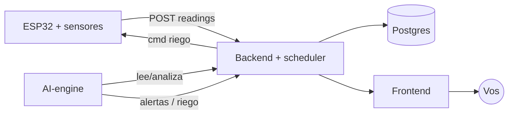

# Puesta en marcha — Mallki Sapan (end-to-end)

Cómo levantar todo el sistema: **Postgres + backend + frontend + AI-engine**, con
datos de prueba, y cómo conectar el hardware real.

## Opción A — Todo con Docker (recomendado para probar)

Requiere Docker + Docker Compose.

```bash
# 1. Levantar el stack completo
docker compose up --build

# 2. (otra terminal) Cargar datos de prueba: sensores + 24h de lecturas,
#    calibraciones, zona, programaciones y alertas
docker compose exec backend npm run db:seed:hidro
```

Listo:

| Servicio | URL |
|----------|-----|
| Frontend (dashboard) | http://localhost:3000 |
| Backend (API) | http://localhost:3001 |
| Health check | http://localhost:3001/health |

El **AI-engine** ya está corriendo dentro del stack y empezará a evaluar los
sensores y a generar alertas. Para habilitar las recomendaciones con Claude,
descomentá `ANTHROPIC_API_KEY` en `docker-compose.yml` y exportá la key antes de
`docker compose up` (`export ANTHROPIC_API_KEY=sk-...`).

> El `seed:hidro` es idempotente: podés volver a correrlo cuando quieras para
> refrescar las 24h de lecturas.

## Opción B — Local sin Docker (para desarrollar)

Necesitás Node 20+, pnpm/npm, Python 3.12+ y un Postgres corriendo.

```bash
# --- Backend ---
cd backend
cp .env.example .env            # ajustá DATABASE_URL
pnpm install
pnpm db:push                    # crea/actualiza el esquema
pnpm db:seed:hidro              # datos de prueba
pnpm dev                        # API en http://localhost:3001 (+ scheduler)

# --- Frontend ---  (otra terminal)
cd frontend
cp .env.example .env.local      # NEXT_PUBLIC_API_URL=http://localhost:3001
pnpm install
pnpm dev                        # http://localhost:3000

# --- AI-engine ---  (otra terminal, opcional)
cd ai-engine
python -m venv .venv && source .venv/bin/activate
pip install -r requirements.txt
cp .env.example .env            # BACKEND_URL, ANTHROPIC_API_KEY (opcional)
python -m src.main
```

## Qué vas a ver

- **Dashboard** (`/`): panel "Solución nutritiva" con pH, temp del agua, nivel y
  EC, y los **gráficos históricos en vivo** (24h) tomando datos del backend.
- **Riego** (`/riego`): control de bomba en vivo (nivel del tanque, "Regar ahora"
  con corte de seguridad) y las **programaciones** persistidas.
- **Configuración** (`/configuracion`): **calibración** de pH/EC guardable, con el
  snippet para `config.h`.
- **Alertas**: las que genera el AI-engine cuando algún parámetro sale de rango.

## Conectar el hardware real

1. Armá el circuito según [`hardware/circuitos.md`](hardware/circuitos.md) (o el
   [dibujo](hardware/circuito-esp32.svg)).
2. En el backend, creá los sensores reales (o reutilizá los del seed) y anotá sus
   `id` (ver [arquitectura §2](arquitectura/arquitectura.md#2-contrato-de-ingesta-hoy)).
3. Cargá esos `id`, tu WiFi y el `BACKEND_HOST` en `arduino/*/config.h` (ver
   [`arduino/README.md`](../arduino/README.md)) y subí el firmware al ESP32.
4. El nodo empezará a postear lecturas reales; el dashboard y los gráficos las
   muestran, el scheduler riega por horario y el AI-engine alerta y decide.

> **Tip:** el firmware del ESP32 lee la calibración desde el backend al arrancar,
> así que calibrás desde la web (Configuración) sin recompilar.

## Flujo completo



Detalle de cada módulo en el [índice de docs](README.md).
